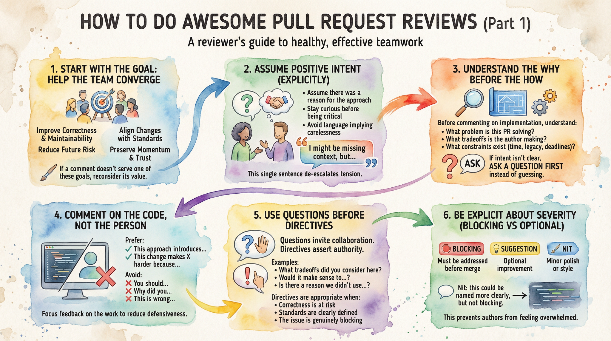
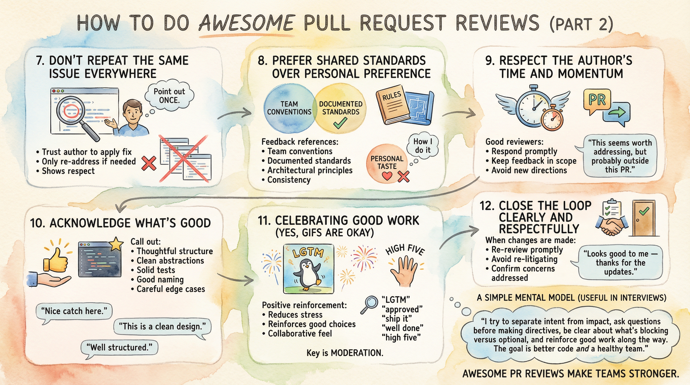

# How to Do Awesome Pull Request Reviews
*A reviewer’s guide to healthy, effective teamwork*

Pull request reviews are one of the most frequent and emotionally loaded forms of collaboration in software teams. They sit at the intersection of correctness, ownership, time pressure, and trust.

An “awesome” PR review isn’t about catching every issue or enforcing personal taste. It’s about helping the team converge on a better solution *together* — while keeping relationships healthy over time.

This guide focuses specifically on **how to review PRs well**, from the reviewer’s perspective.

---

## 1. Start with the goal: help the team converge

A PR review is not an exam and not a gatekeeping exercise.

The primary goals are to:
- improve correctness and maintainability
- reduce future risk
- align changes with team standards
- preserve momentum and trust

If a comment doesn’t serve one of those goals, it’s worth reconsidering whether it belongs.

---

## 2. Assume positive intent (explicitly)

Most PRs represent someone doing their best under constraints you may not fully see.

Good reviewers:
- assume there was a reason for the approach
- stay curious before being critical
- avoid language that implies carelessness or incompetence

Helpful framing:
> “I might be missing context, but…”

This single sentence de-escalates a surprising amount of tension.

---

## 3. Understand the *why* before the *how*

Before commenting on implementation details, try to understand:
- what problem this PR is solving
- what tradeoffs the author might be making
- what constraints might exist (time, legacy code, deadlines)

If the intent isn’t clear, **ask a question first** instead of guessing.

---

## 4. Comment on the code, not the person

This distinction matters more than it seems.

Prefer:
- “This approach introduces…”
- “This change makes X harder because…”

Avoid:
- “You should…”
- “Why did you…”
- “This is wrong…”

Keeping feedback focused on the work — not the individual — reduces defensiveness and keeps the conversation productive.

---

## 5. Use questions before directives

Questions invite collaboration. Directives assert authority.

Examples:
- “What tradeoffs did you consider here?”
- “Would it make sense to…?”
- “Is there a reason we didn’t use…?”

Directives are appropriate when:
- correctness is at risk
- standards are clearly defined
- the issue is genuinely blocking

Otherwise, questions usually lead to better outcomes.

---

## 6. Be explicit about severity (blocking vs optional)

One of the most common sources of PR friction is **unclear priority**.

Good reviewers clearly label intent:
- **Blocking** — must be addressed before merge
- **Suggestion** — optional improvement
- **Nit** — minor polish or style

Example:
> “Nit: this could be named more clearly, but not blocking.”

This prevents authors from feeling overwhelmed or micromanaged.

---

# How to Do Awesome Pull Request Reviews (Part 2)

## 7. Don’t repeat the same issue everywhere

Once an issue has been clearly pointed out **once**, it’s usually unnecessary to repeat the same comment across multiple files or locations.

Repeating feedback:
- adds noise
- increases cognitive load
- can feel punitive rather than helpful

Instead:
- point out the issue once
- trust the author to apply the fix consistently
- only re-address it if they ask for clarification or miss it entirely

This shows respect for the author’s attention and competence.

---

## 8. Prefer shared standards over personal preference

Feedback is strongest when it references:
- team conventions
- documented standards
- architectural principles
- consistency with existing code

Not:
- personal taste
- “how I usually do it”
- theoretical perfection

If a preference isn’t written down, treat it as a **suggestion**, not a requirement.

---

## 9. Respect the author’s time and momentum

A review that sits too long or balloons in scope is costly.

Good reviewers:
- respond promptly when possible
- keep feedback aligned with the PR’s scope
- avoid introducing entirely new directions mid-review

If something important is out-of-scope:
> “This seems worth addressing, but probably outside this PR.”

---

## 10. Acknowledge what’s good (this really matters)

Silence can feel like disapproval.

Call out:
- thoughtful structure
- clean abstractions
- solid tests
- good naming
- careful edge-case handling

Simple comments like:
> “Nice catch here.”  
> “This is a clean design.”  
> “Well structured — easy to follow.”

reinforce positive behavior and balance critical feedback.

---

## 11. Celebrating good work (yes, GIFs are okay)

Some teams like to include light-weight celebration in PR reviews — and when used sparingly, it can be very effective.

A small moment of positive reinforcement can:
- reduce stress
- reinforce good design choices
- make reviews feel collaborative rather than adversarial

Common approaches:
- short compliments (“LGTM”, “Well done”, “Nice work”)
- celebratory reactions
- an occasional GIF

### Using GIFs thoughtfully
Tools like **GIPHY** are widely supported and easy to use in GitHub or Slack.

Search terms that work well:
- `LGTM`
- `approved`
- `ship it`
- `looks good`
- `well done`
- `high five`
- `success`

When used intentionally, a simple GIF can reinforce:
> “This was a good change, and I appreciate the care that went into it.”

The key is moderation — celebration should support the work, not distract from it.

---

## 12. Close the loop clearly and respectfully

When changes are made:
- re-review promptly
- avoid re-litigating resolved points
- confirm when concerns are addressed

End with clarity:
> “Looks good to me — thanks for the updates.”

That closure matters more than people realize.

---

## A simple mental model (useful in interviews)

You can summarize a healthy PR review approach like this:

> “I try to separate intent from impact, ask questions before making directives, be clear about what’s blocking versus optional, and reinforce good work along the way. The goal is better code *and* a healthy team.”

That mindset scales well — technically and emotionally.

---

## Final thought

PR reviews are where technical judgment and human judgment meet every day.

Doing them well isn’t just about code quality — it’s about trust, learning, and sustainable collaboration over time.

Awesome PR reviews don’t just improve a codebase.  
They make teams stronger.

---

## 🤖 Tooling Note

Portions of drafting and editorial refinement in this repository were accelerated using large language models (including ChatGPT, Claude, and Gemini) under direct human design, validation, and final approval. All technical decisions, code, and architectural conclusions are authored and verified by the repository maintainer.
